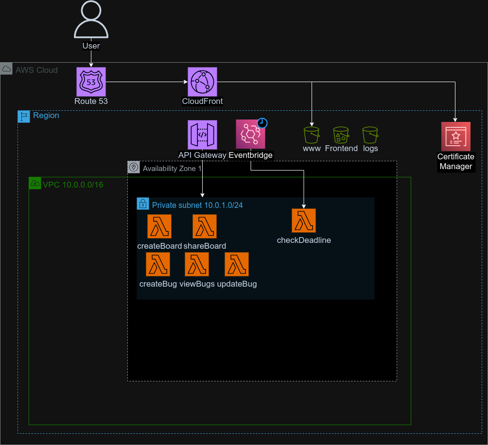

# Cloud Computing - 2023Q2-G4 

El siguiente repositorio contiene el código Terraform para la tercera entrega del TP3 del Grupo 4. 

### Componentes implementados 

1. VPC y Subnets
2. Lambdas + Eventbridge (Scheduler)
3. API Gateway
4. S3 para front-end
5. Cloudfront 
6. Route53 + ACM

### Correr el proyecto
Nótese que hay un proyecto de Terraform secundario llamado terraform-hz que lo único de lo que se encarga es de levantar una hosted zone.  Para poder correr correctamente el proyecto se debe: 
1. Correr primero el proyecto  `terraform-hz`. El mismo levanta una hosted zone y la popula con registros NS populados al azar por AWS.
2. Comunicarse via email con los estudiantes para que vinculen los registros NS proporcionados por AWS en `nic.ar`. Los mismos pueden ser consultados en el output del proyecto. 
3. Una vez recibida confirmación por parte del grupo, se puede continuar levantando la arquitectura principal corriendo `terraform apply` dentro de la carpeta `terraform`

## Funciones
1. `format`
    - *Presente en*
        - `lambda/main.tf` > `data "archive_file" "lambda_zips"`
        - `lambda/main.tf` > `resource "aws_s3_object" "lambda_objects"`
    - *Caso de uso*: Se genera un output path sustituyendo dos placeholders, uno con el directorio objetivo y el otro con el nombre de la función de lambda.
2. `filemd5`
    - *Presente en*: 
        - `lambda/main.tf` > `resource "aws_s3_object" "lambda_objects"` 
        - `S3/main.tf` > `resource "aws_s3_object" "data"`
    - *Descripción*: Se hashea el archivo referido a la funcion de lambda.
3. `length`
    - *Presente en*: 
        - `vpc/main.tf` > `resource "aws_subnet" "private_subnets"`  
    - *Caso de uso*: para indexar subnets
4. `cidrsubnet`
    - *Presente en:*: 
        - `vpc/main.tf` > `resource "aws_subnet" "private_subnets"`
    - *Caso de uso*: para crear las subnets con un cidr calculado de manera programática

## Meta-argumentos
1. `depends_on`:
    - *Presente en:*: 
        - ubicación: route53/main.tf     - ubicación: route53/main.tf ; resource "aws_route53_record" "certs_records"
    - ubicación: route53/main.tf ; resource "aws_acm_certificate_validation" "cert_validation"

2. `for_each`:
    - ubicación: api_gw/main.tf ; resource "aws_lambda_permission" "apigw"
        - descripción: 
    - ubicación: lambda/main.tf ; data "archive_file" "lambda_zips"
        - descripción: 
    - ubicación: lambda/main.tf ; resource "aws_s3_object" "lambda_objects"
        - descripción: 
    - ubicación: lambda/main.tf ; resource "aws_lambda_function" "lambda_functions"
        - descripción: 
    - ubicación: route53/main.tf ; resource "aws_route53_record" "certs_records"
        - descripción: 
    - ubicación: S3/main.tf ; resource "aws_s3_object" "data"
        - descripción: 

3. `count`:

4. `lifecycle`:

# Diagrama

Diagrama entregado en el TP2 pero solamente mostrando los componentes y conexiones implementados:

